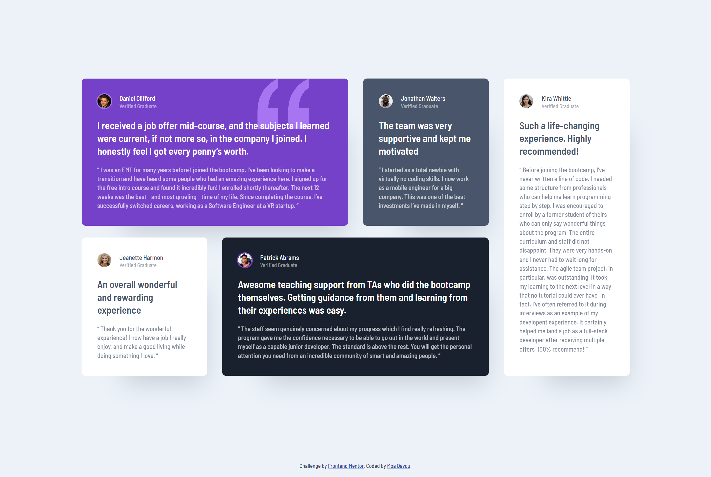

# Frontend Mentor - Testimonials grid section solution

This is a solution to the [Testimonials grid section challenge on Frontend Mentor](https://www.frontendmentor.io/challenges/testimonials-grid-section-Nnw6J7Un7). Frontend Mentor challenges help you improve your coding skills by building realistic projects.

## Table of contents

- [Overview](#overview)
  - [The challenge](#the-challenge)
  - [Screenshot](#screenshot)
  - [Links](#links)
- [My process](#my-process)
  - [Built with](#built-with)
  - [What I learned](#what-i-learned)
  - [Useful resources](#useful-resources)
- [Author](#author)

## Overview

### The challenge

Users should be able to:

- View the optimal layout for the site depending on their device's screen size

### Screenshot

### Links

- Repository URL: [GitHub](https://github.com/moadavou/testimonials-grid-section)
- Live Site URL: [GitHub Pages](https://moadavou.github.io/testimonials-grid-section/)

## My process

### Built with

- Semantic HTML5 markup
- CUBE CSS
- Flexbox
- CSS Grid
- Mobile-first workflow

### What I learned

This project was great to get more hands-on practice with grid. I have a preference for flexbox since I'm more comfortable with it. So doing more projects focusing on grid will help me choose the best tool for the job.

### Useful resources

- [Learn CSS Grid the easy way by Kevin Powell](https://youtu.be/rg7Fvvl3taU?si=liH24ae8u_IqcsaQ) - This helped me better understand the basics of CSS grid. It was also very useful to see how a professional would tackle this challenge.

## Author

- Frontend Mentor - [@moadavou](https://www.frontendmentor.io/profile/moadavou)
- GitHub - [@moadavou](https://github.com/moadavou)
